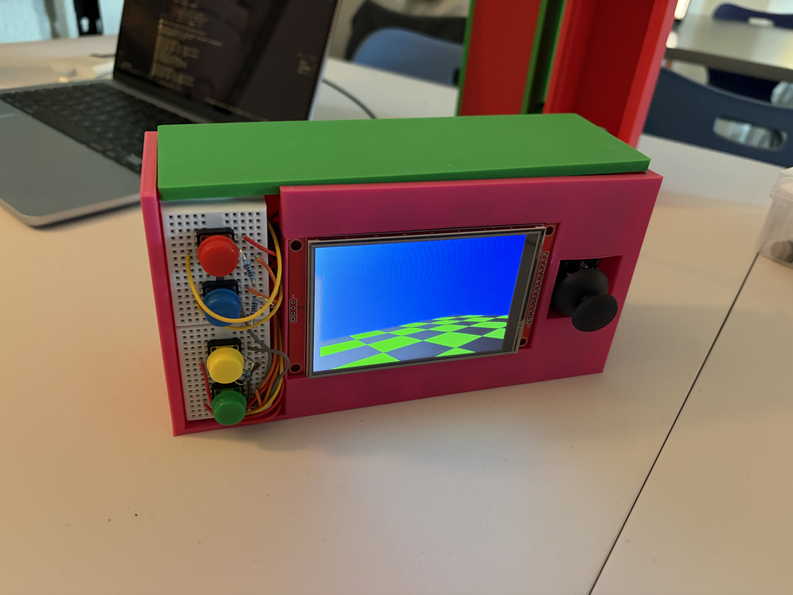

# Minecraft Go

This is a project developed by Rebanto Nath and Sreyas Sabbani for the 2025-26 Embedded Computing class at FCS Innovation Academy.

The goal of this project is to explore how far we can push LCD voxel rendering on constrained microcontrollers while creating an enjoyable game with a unique twist, all in a compact and ergonomic form factor engineered and designed with user experience in mind.

## Game Mechanics

Instead of a traditional game controller, the user looks around by tilting and moving the handheld console. The orientation is detected using an IMU (Intertial Measurement Unit).

---

## Hardware and Schematics

## Development

### Render Pipeline

### Game Engine
